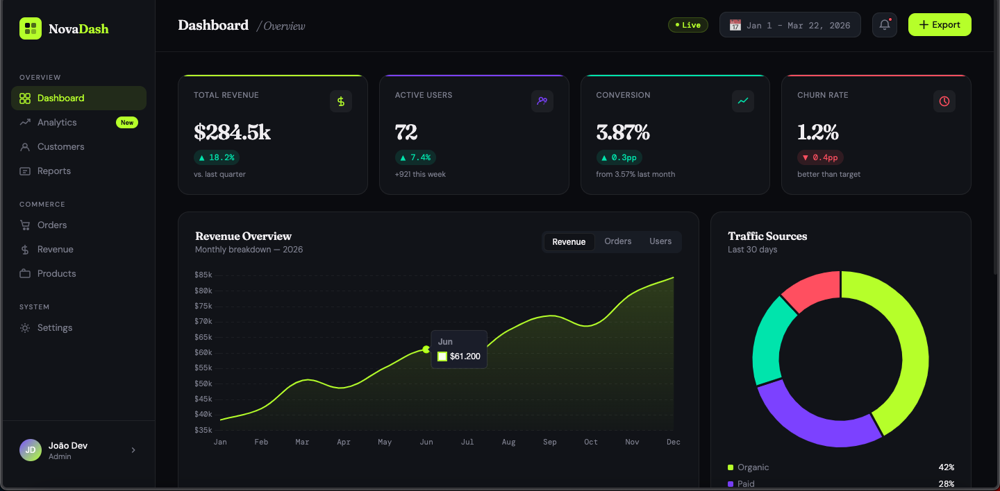

# NovaDash — SaaS Analytics Dashboard

A production-grade analytics dashboard built with **Next.js 14**, **FastAPI**, **PostgreSQL**, and **Recharts**. Designed as a full-stack portfolio project demonstrating real-world architecture, clean component design, and API integration.



---

## Tech Stack

**Frontend**
- [Next.js 14](https://nextjs.org/) (App Router)
- [TypeScript](https://www.typescriptlang.org/)
- [Tailwind CSS](https://tailwindcss.com/)
- [Recharts](https://recharts.org/) — charts & data visualization

**Backend**
- [FastAPI](https://fastapi.tiangolo.com/) — async Python API
- [SQLAlchemy 2.0](https://www.sqlalchemy.org/) — async ORM
- [PostgreSQL](https://www.postgresql.org/) via `asyncpg`
- [Pydantic v2](https://docs.pydantic.dev/) — data validation
- [Alembic](https://alembic.sqlalchemy.org/) — database migrations

---

## Features

- **KPI Cards** — live counters for revenue, users, conversion rate, and churn
- **Revenue Chart** — switchable area chart (revenue / orders / users) with custom tooltip
- **Traffic Sources** — donut chart with source breakdown
- **Top Pages** — session table with animated progress bars
- **Activity Feed** — real-time event stream with live badge
- **Fully typed** — TypeScript on the frontend, Pydantic schemas on the backend
- **REST API** — versioned endpoints (`/api/v1/dashboard/*`) with OpenAPI docs

---

## Project Structure

```
novadash/                  # Next.js frontend
├── src/
│   ├── app/               # App Router pages & layouts
│   ├── components/
│   │   ├── dashboard/     # KPICard, RevenueChart, TrafficChart, TopPages, ActivityFeed
│   │   └── layout/        # Sidebar, Topbar
│   ├── hooks/             # useLiveCounter
│   ├── lib/               # data.ts (mock), utils.ts
│   └── types/             # Shared TypeScript interfaces

novadash-api/              # FastAPI backend
├── app/
│   ├── routers/           # dashboard.py — all API endpoints
│   ├── models/            # SQLAlchemy ORM models
│   ├── schemas/           # Pydantic response schemas
│   ├── db/                # Async engine & session
│   ├── config.py          # Settings via pydantic-settings
│   └── main.py            # FastAPI app + CORS + lifespan
├── tests/                 # pytest async tests
└── seed.py                # Database seeder
```

---

## Getting Started

### 1. Clone the repository

```bash
git clone https://github.com/your-username/novadash.git
cd novadash
```

### 2. Frontend setup

```bash
cd novadash
npm install
cp .env.example .env.local
npm run dev
```

Open [http://localhost:3000](http://localhost:3000)

### 3. Backend setup

```bash
cd novadash-api
python -m venv venv
source venv/bin/activate   # Windows: venv\Scripts\activate
pip install -r requirements.txt
cp .env.example .env
```

Create the database and seed it:

```bash
createdb novadash
python seed.py
```

Start the API server:

```bash
uvicorn app.main:app --reload
```

API docs available at [http://localhost:8000/docs](http://localhost:8000/docs)

### 4. Run tests

```bash
cd novadash-api
pytest tests/ -v
```

---

## API Endpoints

| Method | Endpoint | Description |
|--------|----------|-------------|
| `GET` | `/health` | Health check |
| `GET` | `/api/v1/dashboard/kpis` | Aggregated KPI summary |
| `GET` | `/api/v1/dashboard/revenue` | Monthly revenue time series |
| `GET` | `/api/v1/dashboard/traffic` | Traffic source breakdown |
| `GET` | `/api/v1/dashboard/pages` | Top pages by sessions |
| `GET` | `/api/v1/dashboard/activity` | Recent activity events |

---

## Environment Variables

**Frontend** (`.env.local`)

| Variable | Description |
|----------|-------------|
| `NEXT_PUBLIC_API_URL` | FastAPI base URL (default: `http://localhost:8000`) |

**Backend** (`.env`)

| Variable | Description |
|----------|-------------|
| `DATABASE_URL` | PostgreSQL connection string |
| `API_SECRET_KEY` | Secret key for API security |
| `ALLOWED_ORIGINS` | Comma-separated CORS origins |

---

## Roadmap

- [ ] Authentication with NextAuth.js + JWT
- [ ] Dark/light theme toggle
- [ ] Date range filter connected to API
- [ ] CSV export endpoint
- [ ] Docker Compose setup
- [ ] Deployment guide (Vercel + Railway)

---

## Author

**João Dev** — Full Stack Developer  
[GitHub](https://github.com/joaooln) · [LinkedIn](https://linkedin.com/in/joaooln) · [Upwork](https://upwork.com/freelancers/joaooln)

---

## License

MIT — feel free to use this project as a template for your own work.
